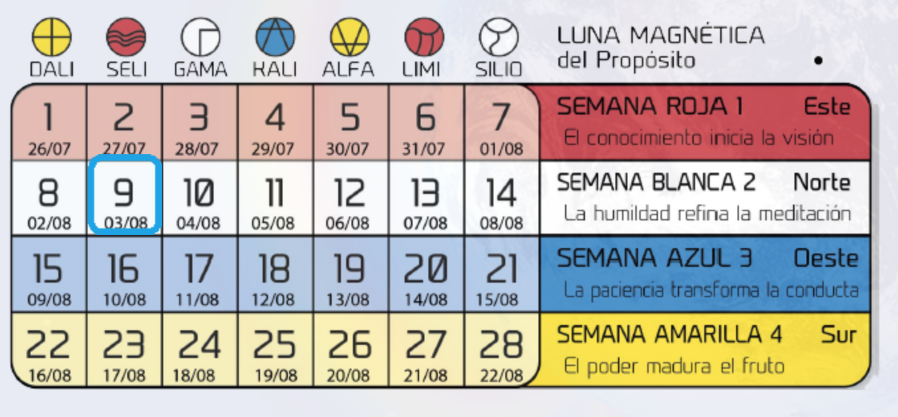

- # 35.1.9 Tierra Roja [17/20] Cristal [12/13] Kin 76
  background-color:: #793e3e
- Tracking
	- wake-time:: 7:30
	- meditation:: 0:25
	- push-ups:: 25
	- running:: 3.6km
	- ashtanga-yoga:: true
- 19:18
	- Recién llego de yoga. Cele está durmiendo.
	- Hace bastante que no estoy creando conscientemente algo en la compu.
		- A excepción de lo que estoy haciendo en LogSeq
		- Mejor dicho: no estuve programando nada; estoy medio bloqueado, Ubiquity está ahí en mi mente pero no activo.
		- Además Cele ahora otra vez "arranca" con la facu y ahora está estudiando para un examen de economía que tiene mañana, así que le estoy haciendo el aguante cuidando a Coral todo el tiempo que pueda; mientras tanto mi trabajo se estanca
		- Necesito encontrar algo en lo que pueda trabajar de forma más esporádica y preferiblemente que les pueda integrar a Coral y a Cele, así el trabajo no me queda tan rígidamente separado del resto de las cosas que hago en el día.
		- Quizás meditar en mi firma galática podría darme un insight.
			- [[Kin 180: Sol Espectral Amarillo]]
	- Me encontré con estas descripciones alternativas de los colores de las heptadas (semanas)
		- 
		-
		-
		-
		-
	-
	-