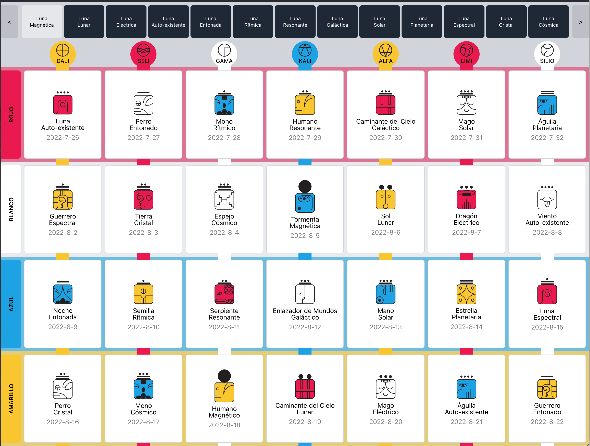

- # Viento (2/20) Auto-Existente (4/13)
	- {{embed ((62eaf300-4843-4283-95ce-4a62f1f9f1d7))}}
	-
- 2:53
	- I'm wrapping up tonight after having worked on https://tzolkin.me progress is looking good [[Proyecto: Sincronario]]
		- 
		- I even set up to publish to Vercel and deploy automatically; it can already be installed as a Progressive Web App
		- Tomorrow I shall:
			- TODO Adapt it to mobile
			- TODO Make a decent favicon
			- TODO Multi-page view so we can show the tzolkin
			- TODO Year selection
			- TODO Scrolling-moon-selector
			-
		-
	-