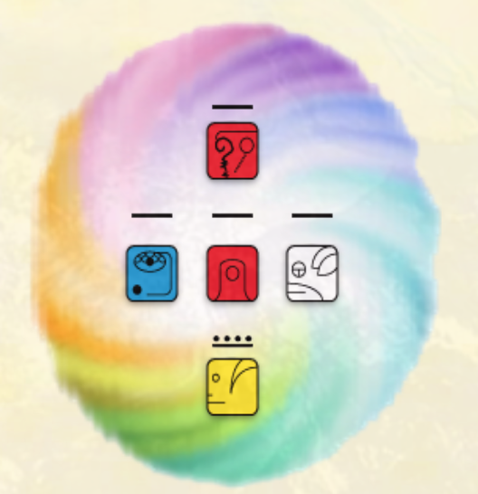

- # 35.2.13 Luna Entonada
  background-color:: #793e3e
	- #kanban
		- {:width 200}
		- Me __empodero__ con el fin de ==purificar==
		  __Comandando__ el ==fluir==
		  Sello el ==proceso== del ==agua universal==
		  Con el tono __entonado__ de la __radiancia__
		  Me guía el poder de la ==navegación==
		  Soy un portal de activación galáctica, entra en mí.
- 22:57
	- Leyendo https://villaging.mystrikingly.com/ #Startover
		- https://zombies.mystrikingly.com/
			- Book As The World Burns by Derrick Jensen
		- https://brightprinciples.mystrikingly.com/
		- https://pointoforigin.mystrikingly.com/
			- EMPTY
		- https://yourbeing.mystrikingly.com/
			- https://www.youtube.com/watch?v=5ALAgUlzxX0&feature=emb_logo
			- YOUBEING.01
				- In South Africa, 'sawubona' is the Zulu word for 'hello'. There's a beautiful and powerful intention behind that word because 'sawubona' literally translated means, "I see you, and by seeing you, I bring you into being."
				- The Experiment is for this week (and perhaps for the rest of your life) greet people by saying, "Sawubona," instead of saying, "Hello. How are you?"
				- PROBLEM: You know what this word means and the other person does not. Therefore you must make special efforts so that your Gremlin does not use this as a way of shocking people, being weird or different. Instead be vulnerable by immediately defining the word and saying why you are using it.
				-
		- https://bullshitdetector.mystrikingly.com/
			- https://becomeunhookable.mystrikingly.com/
	- E instalando una extensión de LogSeq para poner lo de arriba en columnas
	-
	-
	-