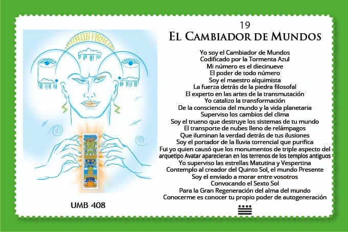
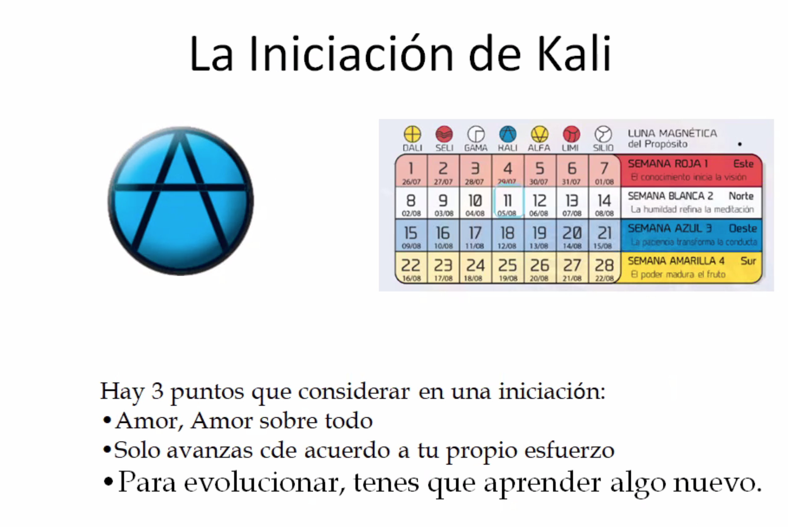
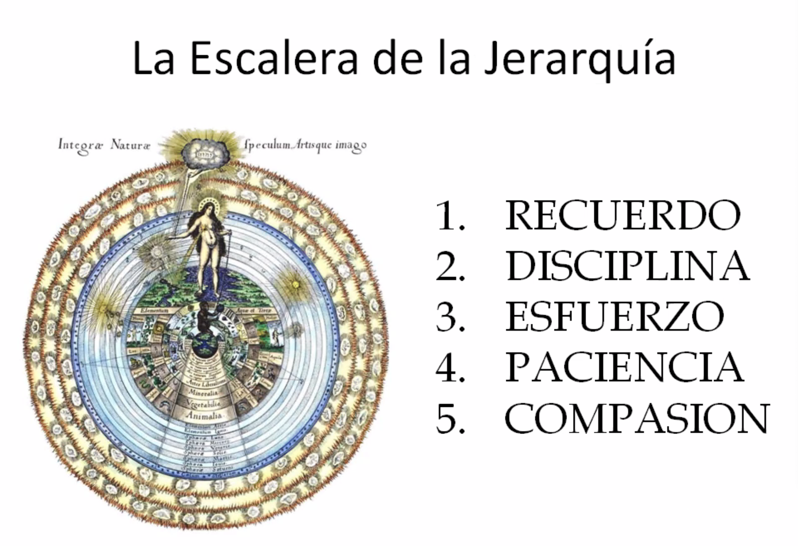
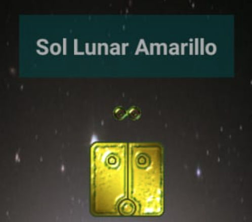
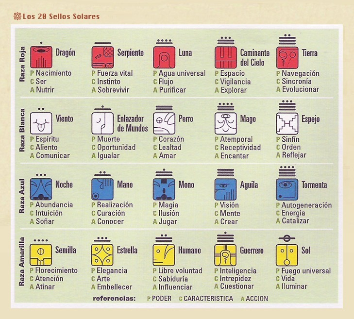
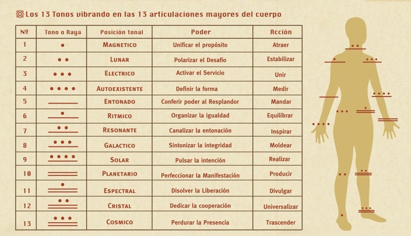

- 
-
- ## Onda encantada de la Tormenta
	- 
-
	-
- Día 1 - Tono 1/13 Magnético  - ~~Viernes 5/8~~ 1.11 Kali - 21-22hs - INVOCACIÓN
  collapsed:: true
	- 
	- 
	-
- Día 2 - Tono 2/13 Lunar - ~~Sábado 6/8~~ 1.12 Alfa - 14-17hs - DATA - **No estuvimos**
  collapsed:: true
	- Programa
	  collapsed:: true
		- 1ra Hora:
		  Matrices de orden y de desorden:
		  La historia del calendario gregoriano
		  El ser tríadico
		  El tiempo es la 4ta dimensión:
		  La Multidimensionalidad
		- 2da Hora:
		  El sagrado Tzolkin Maya
		  Los 13 tonos Galácticos y los 20 sellos
	- Grabaciones
	  collapsed:: true
		- [1ra parte. Sol Lunar Amarillo.mp4](../assets/1ra_parte._Sol_Lunar_Amarillo_1659940000174_0.mp4)
		- [2da parte. SoLunar Amarillo.mp4](../assets/2da_parte._SoLunar_Amarillo_1659939996549_0.mp4)
		- [3ra parte. Sol Lunar Amarllo.mp4](../assets/3ra_parte._Sol_Lunar_Amarllo_1659939992320_0.mp4)
		- [4ta parte. Sol Lunar Amarillo.mp4](../assets/4ta_parte._Sol_Lunar_Amarillo_1659939976727_0.mp4)
	- Día
		- {:width 100}
		- Polarizo con el fin de iluminar
		  Estabilizando la vida.
		  Sello la matriz del fuego universal
		  con el tono lunar del desafío.
		  Me guía el poder de la libre voluntad.
	-
	- 
	- 
	- 
	-
- Día 3 - Tono 5/13 Entonado - ~~Martes 9/8~~ 1.15 Dali - INVOCACIÓN - 21-22hs
	- Programa
		- Noche Entonada Azul
		  Noción del Servicio:
		  Activar  los Sueños
		- La Profecía. 
		  El poder de los sueños: 
		  la relación mente – holograma y las capacidades de proyección. 
		  Viajes en el tiempo: Ciclo SP y GK.
		  La Noosfera y la matriz PSICRONO.
- Día 4 - Tono 8/13 Galáctico - ~~Viernes 12/8~~  1.18 Kali - 21-22hs  - MESA REDONDA - **No estuvimos**
	- [Enlazador Galáctico - Parte 1.mp4](../assets/Enlazador_Galáctico_-_Parte_1_1660449023681_0.mp4)
	- [Enlazador Galáctico - Parte 2.mp4](../assets/Enlazador_Galáctico_-_Parte_2_1660449031197_0.mp4)
- Día 5 - Tono 9/13 Solar - ~~Sábado 13/8~~ 1.19 Alfa - 11-13hs - DATA - **No estuvimos**
	- [Mano Solar Azul - Parte 1.mp4](../assets/Mano_Solar_Azul_-_Parte_1_1660449043416_0.mp4)
	- [Mano Solar Azul - Parte 2.mp4](../assets/Mano_Solar_Azul_-_Parte_2_1660449036524_0.mp4)
- Día 6 - Tono 10/13 Planetario - ~~Domingo 14/8~~ 1.20 Limi - 21-22hs - MESA REDONDA
	-
	-