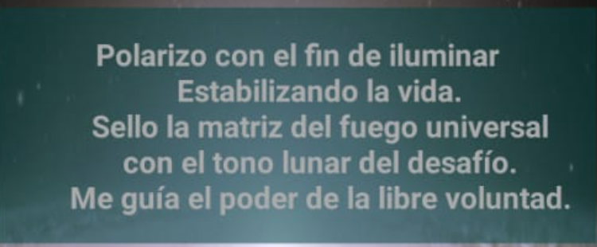

- 
-
- Día 2
	- 1ra Hora:
	  Matrices de orden y de desorden:
	  La historia del calendario gregoriano
	  El ser tríadico
	  El tiempo es la 4ta dimensión:
	  La Multidimensionalidad
	- 2da Hora:
	  El sagrado Tzolkin Maya
	  Los 13 tonos Galácticos y los 20 sellos
	- 
	-
	- 
	-
	-
	- 
	- 
	- 
	-
-