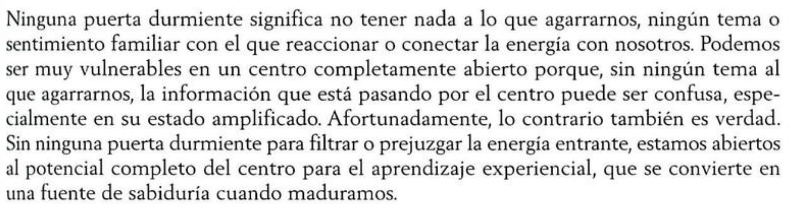

- https://thehumandesignlab.com/que-es-diseno-humano/
- Auras
  collapsed:: true
	- Generadores
	- Manifestadores
	- Proyectores (Fede dice que yo debo ser proyector)
	- Reflectores
- ---
- 
-
- 
- ## Como leer los diagramas
  collapsed:: true
	- Rojo = Diseño inconsciente
	- Negro = Personalidad consciente
	- 
	- 
	- 
	- 
- ## Preguntas para centros abiertos
  collapsed:: true
	- 
- # Garganta
  collapsed:: true
	- El enfoque más saludable para las personas con la Garganta abierta es dejar de tratar de controlar lo que dicen; están diseñadas para hablar espontáneamente y disfrutar las diferentes voces o formas de expresión que experimentan.
	- ## Sin definir
		- Puertas
			- Diseño:
				- 8: La solidaridad; La Puerta de la Contribución
					- Yo puedo contribuir o no
					- Autoexpresión única
			- Personalidad:
				- 62: La preponderancia de lo pequeño; La Puerta del Detalle
					- Yo pienso o no
					- Comunicar el detalle de los hechos
				- 45: La reunión; La Puerta del Recolector
					- Yo tengo o no
					- El Rey/la reina que guía mediante la educación
			- Diseño/Personalidad:
				- 12: La paralización; La Puerta de la Cautela
					- Yo sé que puedo intentarlo o no
					- Cauteloso socialmente
- # Centro de la Cabeza
  collapsed:: true
	- La inspiración de la cabeza es como una presión que impulsa a nuestra actividad mental
	- Inicia pensamientos cotidiatnos e interorgantes más elevados acerca de los misterios de la existencia
	- Es la presión para hacer preguntas y esperar respuestas
	- > Desgraciadamente cuando el no-ser usurpa el papel de nuestra Autoridad personal, el Centro de la Cabeza inicia una corriente de preguntas y pensamientos irrelevantes acerca de cosas que no importan realmente. Esto puede convertirse en una presión incesante por saber, que nos llena de dudas y confusión, alejándonos más de nosotros mismos.
	- ## Completamente abierta
		- > No saben en qué enfocarse, especialmente en esta abrumadora era de la información.
		- > O se pueden distraer con facilidad debido a la presión de idear respuestas
- # Centro de la Raíz
	- ## Sin definir
		- Con el paso del tiempo, este tipo de condicionamiento puede convertirse en hiperactividad, inquidtud incontroloable e incapacidad de centrarse.
		- Cuando operan correctamente
			- No se juzgan a si mismas como holgazanas o imcompetentes si no logran trabajar deprisa o simplemente no quieren hacerlo.
-
- # Centro Sacral
	- Toda la vida del planeta se nutre de la energía vital generada en este centro.
	- El ciclo de trabajo/descanso de este motor require que agote su suministro de energía disponible cada día para poder dormir bien.
	- Si tu centro sacral es definido, sos de tipo generador.
	- Complejidad, capacidad de general fuerza vital, y habilidad para cominicar momento a momento su disponibilidad mediante sus propis sonidos guturales.
	- ## Definido
		-
-