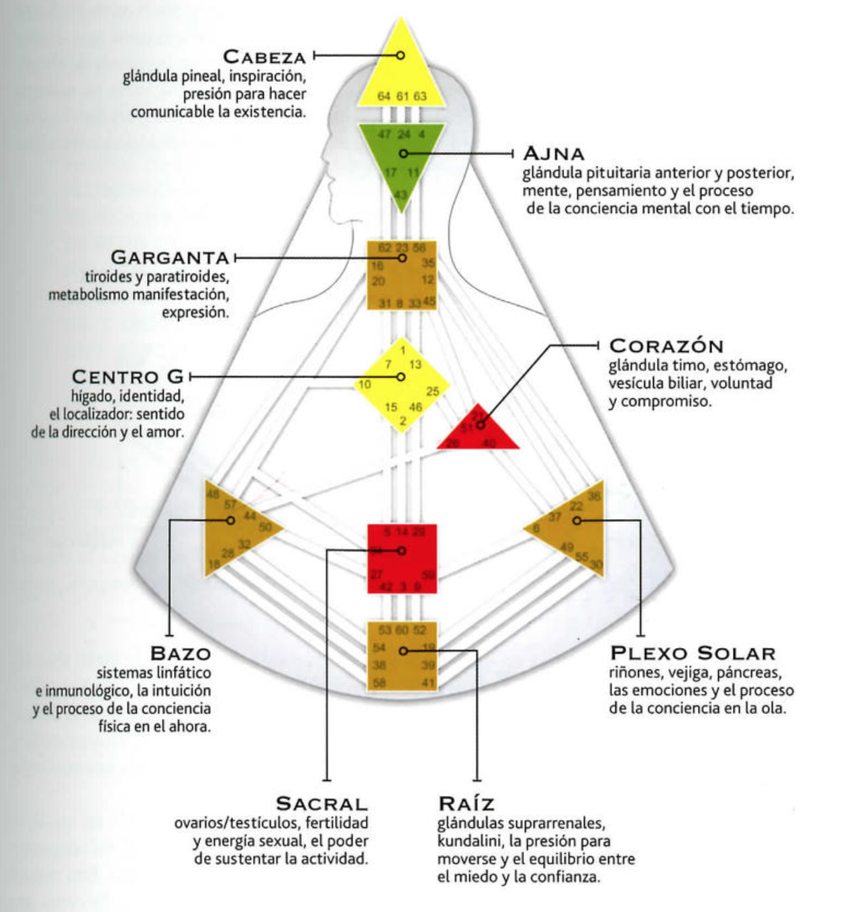

- https://thehumandesignlab.com/que-es-diseno-humano/
- Auras
  collapsed:: true
	- Generadores
	- Manifestadores
	- Proyectores (Fede dice que yo debo ser proyector)
	- Reflectores
- ---
- 
-
- 
- ## Como leer los diagramas
  collapsed:: true
	- Rojo = Diseño inconsciente
	- Negro = Personalidad consciente
	- 
	- 
	- 
	- 
- ## Preguntas para centros abiertos
  collapsed:: true
	- 
- # Garganta
  collapsed:: true
	- El enfoque más saludable para las personas con la Garganta abierta es dejar de tratar de controlar lo que dicen; están diseñadas para hablar espontáneamente y disfrutar las diferentes voces o formas de expresión que experimentan.
	- ## Sin definir
		- Puertas
			- Diseño:
				- 8: La solidaridad; La Puerta de la Contribución
					- Yo puedo contribuir o no
					- Autoexpresión única
			- Personalidad:
				- 62: La preponderancia de lo pequeño; La Puerta del Detalle
					- Yo pienso o no
					- Comunicar el detalle de los hechos
				- 45: La reunión; La Puerta del Recolector
					- Yo tengo o no
					- El Rey/la reina que guía mediante la educación
			- Diseño/Personalidad:
				- 12: La paralización; La Puerta de la Cautela
					- Yo sé que puedo intentarlo o no
					- Cauteloso socialmente
- # Centro de la Cabeza
  collapsed:: true
	- La inspiración de la cabeza es como una presión que impulsa a nuestra actividad mental
	- Inicia pensamientos cotidiatnos e interorgantes más elevados acerca de los misterios de la existencia
	- Es la presión para hacer preguntas y esperar respuestas
	- > Desgraciadamente cuando el no-ser usurpa el papel de nuestra Autoridad personal, el Centro de la Cabeza inicia una corriente de preguntas y pensamientos irrelevantes acerca de cosas que no importan realmente. Esto puede convertirse en una presión incesante por saber, que nos llena de dudas y confusión, alejándonos más de nosotros mismos.
	- ## Completamente abierta
		- > No saben en qué enfocarse, especialmente en esta abrumadora era de la información.
		- > O se pueden distraer con facilidad debido a la presión de idear respuestas
- # Centro del Bazo
  collapsed:: true
	- Vida completamente existencial, espontaneidad, salud y bienestar, valores, sistema inmunológico.
	- Es el núcleo de nuestro sistema inmunológico, sistema linfático.
	- Miedo primario respecto a supervivencia y bienestar; fuente de alegría y risa, espontaneidad y audacia. Conciencia existencial, conciencia en el momento, nos mantiene avanzando de forma segura mientras limpia constantemente la acumulación de toxinas y efectos adversos de memorias/vibraciones negativas de nuestro sistema.
	- Es un centro de conciencia (junto al Ajna y el Plexo Solar); los otros 6 funcionan a nivel puramente mecánico.
		- Siendo el centro de consciencia más antiguo nos conecta a todas las formas de vida. Función esencial ha sido siempre mantener viva la forma.
	- Alerta instantánea e instintivamente ante cualquier cosa que amenace nuestro bienestar, incluidas las vibraciones emocionales negativas. Opera con miedo, porque el miedo genera alerta. Una forma de inteligencia que permanece alerta.
	- El Ajna es el doble de fuerte que el Bazo, y el Plexo Solar el doble que el Ajna. Al ser el más debil de los tres, las voces del no-ser de esos otros dos centros pueden eclipsar con facilidad las pequeñas y calladas alertas que llegan de nuestra consciencia del Bazo.
	- Toda conciencia comienza con el miedo, cada uno de los tres centros de conciencia tienen su propia frecuencia del miedo.
	- Cada puerta representa un miedo primario por la supervivencia. La conciencia del sistema del Bazo es un aspecto de nuestra inteligencia que se crea cada vez que afrontamos y sobrevivimos a un desafío, cargado de miedo, a nuestra existencia, nuestra confianza y nuestro bienestar.
	- ## Definido
		- Opera en el momento presente, en el ahora. Es la intuición, instinto visceral o corazonada; nos permite hacer juicios o tomar decisiones espontáneas fiables.
		- El Bazo nunca repite su primera alarma, así que hay que prestar atención.
		- Quienes tienen el Centro del Bazo definido como su Autoridad deben escuchar a su intuición, hacer lo que les die que hagan y no dejar que su no-ser o la mente de cualquier otra persona les distraiga de seguir sus propios instintos, que son dignos de confianza y producen resultados fiables.
		- Vivir plenamente en el momento presento con un abandono despreocupado, pero prudente, es el resultado de una profunda armonización con la existencia. Requiere una confianza  en la consciencia de su vehículo, la inteligencia de su cuerpo, para que les guíe y les proteja a lo largo de su vida, segundo a segundo.
		- La conciencia existencial no se puede racionalizar; simplemente hay que confiar en ella. La perspectiva mayor de una experiencia solo se puede comprender mirando atrás después del hecho.
		- Para el Bazo el momento presente es lo único que importa, lo único de lo que es consciente.
	- ## Sin definir
		- Entran en el mundo con un miedo fundamental de no estar equipades para sobrevivir aquí en la Tierra.
		- Están abiertos y son sensibles a la falta de bienestar en el mundo.
		- Cuando las personas de su entorno que tienen el Bazo definido les condicionan, se sienten mejor y más seguros.
		- Mantra: Nunca tomes una decisión espontánea
		- En última instancia, pueden volverse altamente intuitivas ellas mismas. Sin embargo, su Bazo sin definir nunca es un recurso fiable para tomar decisiones, porque es muy vulnerable al condicionamiento de su entorno.
		- La sabiduría que llega con el tiempo permite que cuando entran en el aura de sus pacientes hay un reconocimiento espontáneo, la sensación de si la personas está sana o enferma y que podría estar desequilibrado.
			- Esta empatía surge cuando el Bazo sin definir aprende a distinguir entre las propias energías y lo que se está filtrando a través de los demás.
	- ## Completamente Abierto
	- ## Puertas
		- 48
			- El pozo
			- La Puerta de la Profundidad
			- Miedo a sentirse inadecuado
			- Conciencia de una solución potencial, o no.
			- Miedo a no tener la suficiente profundidad, o estar buscando la profundidad para librarse del miedo.
		- 57:
			- Lo suave
			- La Puerta de la Claridad Intuitiva
			- Miedo al futuro
			- Conciencia de oír la verdad en el momento, o no.
			- Miedo a lo que pueda traer el futuro, que hace que te refrenes.
		-
- # Centro del Plexo Solar
	- Consciencia del espíritu
	- Consciencia emocional y social, espontaneidad, pasión y deseo, abundancia del espíritu, sentimientos, humores, sensibilidad
	- Ningún otro centro en nuestro tiempo tiene un impacto más profundo en la humanidad.
	- Cada centro de consciencia tiene una frecuencia única:
		- Bazo opera el ahora
		- Ajna opera con todo el tiempo
		- Plexo Solar opera una oscilante ola bioquímica con el paso del tiempo
	- Nuevo tipo de consciencia; consciencia del espíritu; evolución culminará en el 2027.
		- Tiene que ver con la unidad y experimentarnos como una única entidad.
		- Sucede cuando las olas emocionales entre dos o más seres están en resonancia
	- Para crear estabilidad emocional en nuestra vida y en todo el mundo, debemos comprender, aceptar y, con el tiempo, trascender este patrón de ola. La clave es esperar. Esperar a loa largo de las subidas y bajadas va aumentando nuestro entendimiento, la ola comienza a estabilizarse y con el tiempo llega la claridad.
	- Alguien que está definido emocionalmente puede dejar de emitir al entorno emociones reactivas, prematuras, caóticas o dañinas.
	- Olas
		- Ola tribal (canales 19-49, 37-40)
			- Va subiendo paulatinamente hasta que explota y entonces se reposiciona para volver a empezar el proceso de nuevo.
			- Tomamos de ejemplo una persona cuyo compañere está haciendo algo que le molesta. No le dice como se siente, de modo que esto continúa durante semanas. Cada vez que hace eso le molesta, la ola sube a un nuevo nivel, hasta que un día explota. Su compañere no tuvo ningún indicio, no lo vio venir, así se produce una gran sorpresa.
				- El arrebato emocional de su compañere le puede resultar duro, pero a su vez, ha liberado sus emociones contenidas, y vuelve a la normalidad: todo está bien. Cuando ambos comprenden la mecánica (como anticipar la explosión, como resolver las verdaderas cuestiones y como los arrebatos les afectan de una manera diferente) se sentirán más comodes y comprenderán mejor su relación.
					- Por ejemplo, un aumento gradual de la tensión emocional, mezclado con un deseo de intimidad, puede liberarse calmada y eficazmente poniéndole la mano en el hombro al final de un día largo y duro. Para la tribu no son necesarias las palabras, todo está en el contacto físico.
	- Lo importante para comprender sobre la ola emocional es que es simplemente un proceso químico ineludible que mantiene la ola contínuamente en movimiento. Sus cambios y altibajos no van acompañados de ninguna explicación. Sin esta consciencia, quienes tienen este centro definido, intentan racionalizar sus emociones o explicar o idear alguna razón por estos altos o bajos.
	- Ya estemos definidos o sin definir y absorbiendo las olas de condicionamiento de otras personas, tenemos que tener cuidado para no identifcarnos con la ola o sus movimientos como si fuéramos eso. Permanece como un observador objetivo: no somos la ola; sino que la ola nos está llevando a nuestras profundidades.
	- Tanto los altos como los bajos de las olas pueden ser hermosos si no dejamos que ninguno de ellos perturbe nuestra tranquilidad interior; la tranquilidad de saber que esto es 'normal' para nosotres.
	- La sociedad perpetúa la idea de que deberíamos ser felices continuamente. debido a esto la mayoría de las personas definidas emocionalmente vive luchando contra la parte baja de su ola, convencidas de que pasa algo malo. La verdadera liberación llega cuando aprenden a observar, aceptar y amar toda la cama y dones de su ola.
	- ## Consciencia y nerviosismo
		- Nos miedos que acompañan al estado presente de consciencia se experimentan como nerviosismo basado en la incertidumbre emocional.
		- Cada centro de conciencia engendra una forma particular de miedo. En el Plexo Solar, el miedo se manifiesta como nerviosismo en torno a relacionarse con los demás, ya que la ola bioquímica en constante movimiento les deja inciertos emocionalmente.
	- ## Puertas
		- 36: Zeq; Coral
			- El oscurecimiento de la luz
			- La Puerta de la Crisis
			- Miedo a ser inadecuado
			- Guiado por el apetito de tener el reto de una nueva experiencia.
			- Nerviosismo acerca de ser inadecuado sexual o emocionalmente.
		- 6: Zeq
			- El conflicto
			- La Puerta de la Fricción
			- Miedo a la intimidad
			- Una especie de diafragma que produce una ola abriendo o cerrando la intimidad.
			- Nerviosismo acerca de revelar quién eres realmente.
		- 49: Cele; Coral
			- La revolución
			- La Puerta de los Principios
			- Miedo a la naturaleza
			- Una ola que acepta o rechaza principios basándose en las necesidades de la tribu.
			- Nerviosismo acerca del rechazo, imprevisibilidad y las consecuencias.
		- 22: Coral
			- La gracia
			- La Puerta de la Apertura
			- Miedo al silencio
			- Abierto a escuchar... cuando estás de humor
			- Incierto sobre si alguien te escuchará o sobre si hay algo digno de ser escuchado
		- 30: Coral
			- El fuego adherente
			- La Puerta de los Sentimientos
			- Miedo a los hados
			- Produce una ola muy poderosa nutrida por el deseo de sentir profundamente.
			- Nerviosismo acerca de lo que podría o no podría suceder.
	- ## Sin definir
		- Absorbe y amplifica las emociones presentes en su entorno.
		- Particularmente vulnerables a las necesidades, humor y sentimientos de otras personas.
		- Crucial saber cuando las emociones que están sintiendo y expresando son enteramente suyas, y pueden liberarlas y protegerse no identificándose con ellas.
		- Habilidad de simplemente reflejarle una emoción a su verdadero dueño.
		- Niñes abiertos emocionalmente absorben y personalizan los altibajos emocionales de su familia, amplificando y a menudo exteriorizando su confusión. Pensando que son personalmente responsables de crear las olas, deciden a una edad temprana que es mejor mentir u ocultar dentro de sí su propia verdad que sufrir el estallido emocional de uno de sus padres.
		- Confrontación pone nerviosas a las personas sin definición emocional. Cuando maduran, desarrollan estrategias del no-ser para evitar reacciones emocionales eludiendo confrontar a los demás por miedo a perturbar la calma o molestar a alguien. Desarrollan un caracter que dice "Yo no te molestaré a tí si tú no me molestas a mí"
		- Tratan de apartarse de cualquier confrontación potencial que podría suceder si se atreven a expresar su propia verdad o sus necesidades.
		- Si evitan siempre las confrontaciones, viven su vida a un nivel superficial.
- # Centro de la Raíz
  collapsed:: true
	- ## Sin definir
		- Con el paso del tiempo, este tipo de condicionamiento puede convertirse en hiperactividad, inquidtud incontroloable e incapacidad de centrarse.
		- Cuando operan correctamente
			- No se juzgan a si mismas como holgazanas o imcompetentes si no logran trabajar deprisa o simplemente no quieren hacerlo.
- # Centro Sacral
	- Toda la vida del planeta se nutre de la energía vital generada en este centro.
	- El ciclo de trabajo/descanso de este motor require que agote su suministro de energía disponible cada día para poder dormir bien.
	- Si tu centro sacral es definido, sos de tipo generador.
	- Complejidad, capacidad de general fuerza vital, y habilidad para cominicar momento a momento su disponibilidad mediante sus propis sonidos guturales.
	- ## Definido
		- Las personas con el Sacral definido no saben realmente, o no pueden saber, lo que es correcto para ellas a menos que oigan la respuesta de su Sacral. Reconectar con sus sonidos y aprender a confiar de nuevo en ellos son los primeros pasos hacia vivir siendo fieles a si mismas y estableciendo el potencial para la transformación personal.
		- A-já -> Sí, úh-uh -> No
		- Genera cierta cantidad de energía cada día, se experimenta como una inquetud, incapacidad de estarse quieto o necesidad de quemar energía estando activo. NAda es tan importante como encontrar la expresión personal y la satisfacción profunda usando su suministro diario de energía para el trabajo o actividades que le gusten.
		- Es muy poderoso cuando le hacen una pregunta que requiere un sí o un no. Respuesta inmediata revela si energía está disponible en ese momento. Si es afirmativa, todo el poder del  Sacral está detrás de esa decisión. Si es poco entusiasta, la actividad no se puede mantener sin extralimitar la energía generativa del Sacral.
		- Respuesta del sacral establece un limite sano y claro.
		- No pueden cumplir compromisos que no han adquirido correctamente a través de la respuesta; esta energía no está disponible para apoyar decisiones tomadas con la mente.
		- No acabar lo que han empezado.
		- La naturaleza de la frecuencia del Sacral es perseverar para dominar una destreza o adquirir una habilidad.
		- A diferencia de la Garganta, la energía del Sacral alcanza determinados niveles y debe tener la fuerza para persistir durante estos puntos 'estancamiento' hasta que un avance repentino (iniciación) nos impulse hasta el nuevo nivel de maestría.
		- Mantra: no inicies, espera  y makt
		- Puertas
			- 34: El poder de lo grande; La Puerta del Poder
				- Poder puro para potenciar
-