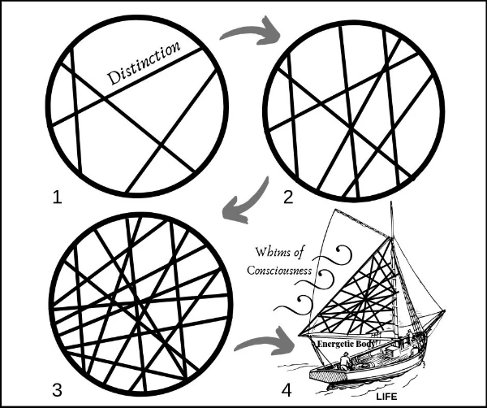

- A Distinction is an energetic declaration. When you get a distinction it lands in your [[Matrix]] and reorders your [[Energetic Body]] in such a way that you can experientially differentiate something that you could not differentiate before. This gives you [[Possibility]] in [[Action]] and it allows you to create new [[Results]]
- The ability to make distinctions comes from wielding and knowing how to use the [[Sword of Clarity]], which is part of your [[Energetic Toolbelt]].
- Each Distinction in your Energetic Body acts like a thread on a net in the [[Matrix]] structure that allows you to catch more [[Consciousness]].
	- 
	-
- It is possible that the [[Gameworld]] you are supposed to build does not belong to you, but to consciousness itself using you - and your hands and mouths - to manifest reality.
- While [[Holding a Space]], the process of clarifying the Distinctions that will be used in that [[Space]] is called [[Setting Context]]. As the net gets tighter,
- ---
	- Reference: https://distinction.mystrikingly.com/
	-