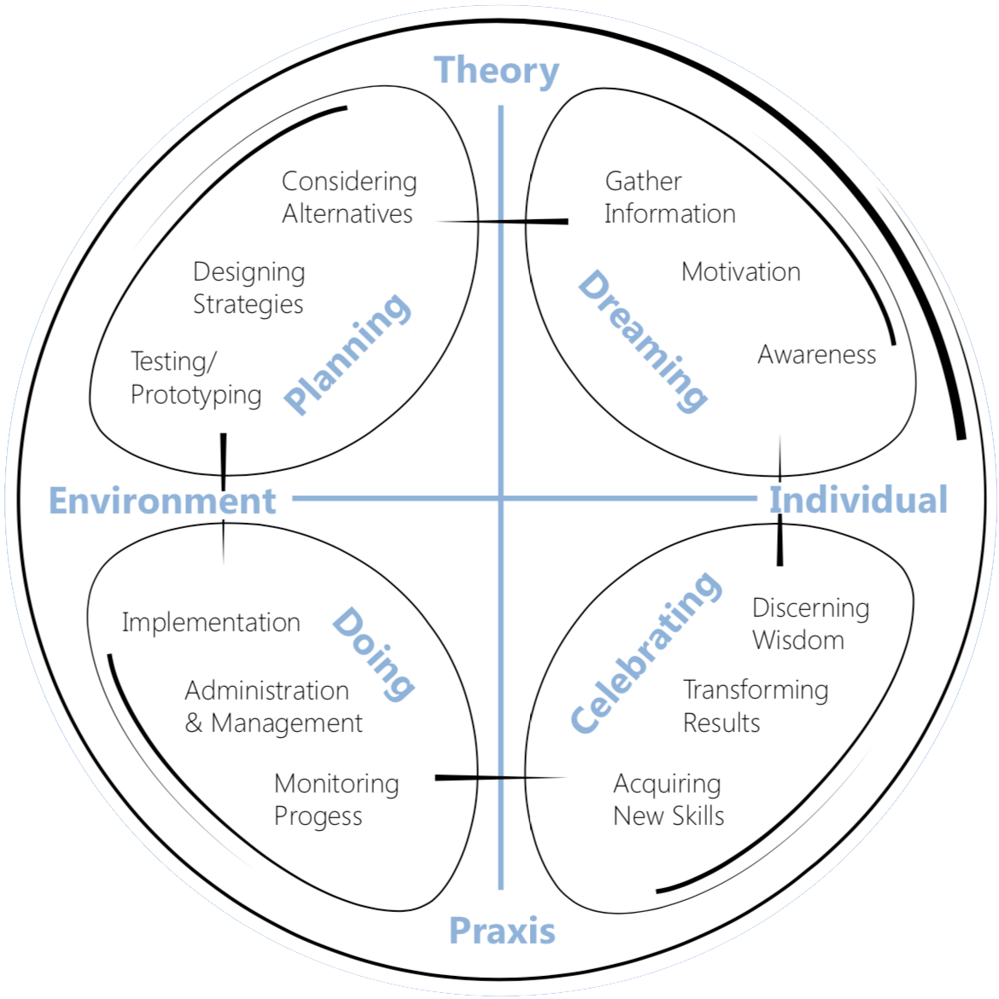

- 
- ## Filosofía
	- Tres objetivos
		- Servicio a la tierra
		- Construir comunidades
		- Crecimiento Personal
			- Momentos "Ajá"
	- Concepto aborigen del Tiempo
		- Soñar se vive como una experiencia colectiva y objetiva
	- Lineas de Canción
	- Juego de ganar-ganar (Qué tal la idea de [[Possibility Management]] de [[Winning Happening]]?)
- ## Comunicación
	- Preguntas generativas
		- Demanda de empoderamiento personal
		- Invitación abierta para atraer algo no conocido. Manifestar el elemento que falta, cuyo contenido marcará la diferencia.
		- Eje central de Dragon Dreaming
	- El Pinakarri
		- Palabra aborigen significa "Escucha profunda"
		- Escuchar con empatía
		- Voz mental que constantemente nos habla de juicios ganar-perder; nos distrae.
		- Participantes pueden accionar Pinakarri con señal (por ejemplo campana) en cualquier momento
			- Cuando se acciona todes se quedarán en silencio durante un tiempo de relajación y entrega profunda
		- Guía resumida:
			- 1. Conecta con tu cuerpo
			  2. Siente el peso del cuerpo
			  3. Respira profundamente
			  4. Puedes secuchar el latido de tu corazón?
			  5. Respira hacia el punto más fuerte de tensión en el cuerpo; relaja, suelta tensión al espirar.
			  6. Existen muchas maneras de conseguir Pinakarri; experimenta!
	- Comunicación Carismática
		- El lenguaje de ganar-ganar
		- Decir lo que realmente queremos de forma profunda
		- Basada en la confianza
			- Necesito confiar en el otro para poder compartir mis sentimientos y mis sueños sin que pueda reírse o burlarse
		- Utilizamos nuestra intuición para que el proyecto se exprese a través de nosotres
		- Guía:
			- 1. Practicar Pinakarri
			  2. Mover atención hacia el centro físico (centrarse). En DD se le dice Hara, centro de equilibrio.
			  3. Visualiza burbuja en [[Tu burbuja]] que se expande  hacia cada persona con la .
			-
		-
		-
		-
- ## Anexo
	-
	- {:width 500}
	- 
		- Given this replacement of matter, my
		  body is right now teaching the muesli I ate for breakfast all my memories of childhood. If my
		  body did not have this capacity of teaching, and the muesli the capacity of learning, these
		  memories would be gone for ever.
		-