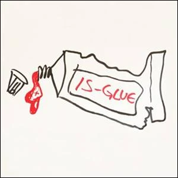

- #.v-kanban
	-
		- You were born with a large-size tube of 'Is Glue' on your [[Energetic Toolbelt]]. No one needed to explain to you how to use your Is Glue. Everyone uses it, so you use it too.
		  id:: 63294433-fd96-4fa5-b6db-4f37a72e0465
		- The Golden Key for [[Declaring What Is So]] conscious is to make your use of 'Is Glue' conscious.
		- 'Is' does not exist in nature. It is a concoction of the human mind. No other animals use 'Is Glue'.
		  All the kinds of Declaring function by large and - until now - mostly unconscious doses of 'Is Glue'.
	- 
-
- ## Is Glue Conjuctions / Formulations
	- is / isn't
	- am
	- are / aren't
	- was / wasn't
	- were / weren't
	- has / hasn't
	- have / haven't
	- had / hadn't
	- do / don't
	- does / doesn't
	- did / didn't
	- may
	- mightn't
	- mustn't
	- can / can't / cannot
	- could / couldn't
	- should / shouldn't
	- would / wouldn't
	- shall / shan't
	- will / won't
- ## Experiments
	- Make a video of the Is Conjugation
		- Memorize the conjugations of is
-
- ---
- Reference: https://isglue.mystrikingly.com/