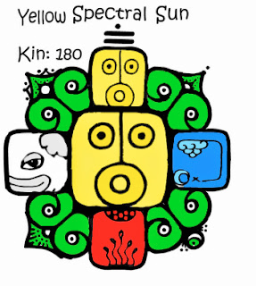
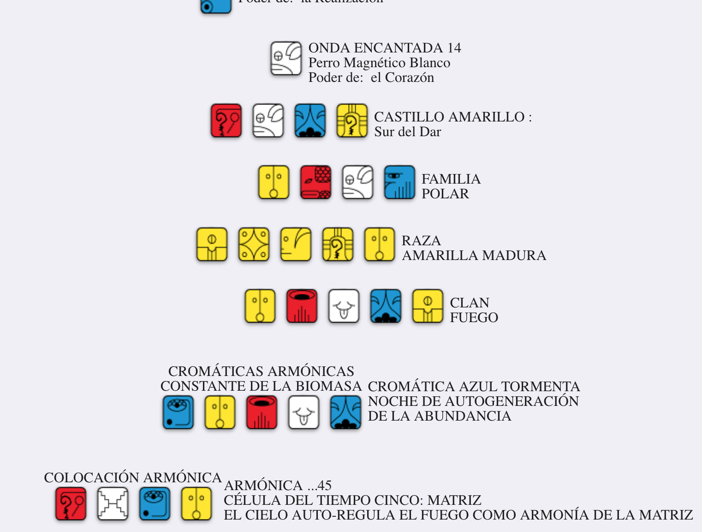

id:: 62eaf657-d7e1-4597-8d08-8dd7ee6d112f
title:: Kin 180: Sol Espectral Amarillo

- 
- {{embed ((62e6ae06-af1d-4d4d-86f4-eae45ec547d7))}}
- 
- Onda encantada del perro
- Sol
	- Gobernado por plutón
	- Regido por el chakra corona
	- Dedo pulgar de la mano derecha
		- Circula el meridiano del pulmón
	- Nombre maya: Ahau
	- Raza: Amarilla -> Maduradora
-
- Mantra
	- Yo disuelvo con el fin de iluminar
	- Divulgando la vida
	- Sello la matriz del fuego universal
	- Con el tono espectral de la liberación
	- Me guía mi propio poder duplicado
	- Soy un kin polar. Transporto el espectro galáctico amarillo.
- Interpretaciones
	- https://conlasalasdelalma.com/2021/06/12/kin-180-sol-espectral-amarillo-vida/
		- In Lak'ech: "Yo soy otro tú" / "Tú eres otro yo"
	- http://elyhoy.blogspot.com/2014/04/sol-espectral-amarillo-bolon-ahau-kin.html
		- "Verdad es Amor, Tolerancia es Justicia-La Paz es para Siempre"
	- https://groups.google.com/g/foro-esencia/c/J3JWKq7lpZA/m/9feWnWcF6OEJ?pli=1
		- 
		-
	-