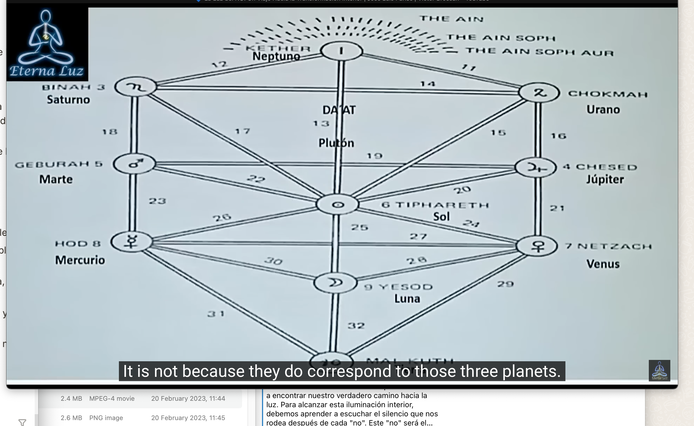

- https://www.youtube.com/watch?v=Dqvzlp-Ixbo
- Entrevista: José Luis Parise - Victor Brossah
- José Luis Parise: Director escuela edipo.org
- arteritual.com
- Luz / Oscuridad
- Sí / No
- Placer / Búsqueda de crecimiento
- Nuestra propia carcel
- Láminas de esquemas de culturas originarias
- Cuestiones de lo iniciático
- Si llega por los canales de los medios masivos de comunicación, cumple función de arqueotipo que se decide como paradigma y a tí no te da lugar, no da lugar de 1-1
	- Uno no puede ser el objeto de un paradigma que lo lleve a su iniciación
	- Cuando se convierte en un paradigma cultural, ya no sirve.
- La idea de encontrar la luz, y que la oscuridad es un problema demuestra que no tenés la más mínima idea de como es el camino.
- Gurú: Significa oscuridad y luz.
- 
- 4 estados luminosos de la mente
	- En cultura moderna lo anclan al hemisferio interno; no es así.
- Contingente: Lo que uno cree que no puede manejar
- Posible -> Necesario = Eje de luz / Eje de lo que sí / Eje de lo denso
- Imposible -> Contingente = Eje de lo que no
- No se puede iluminar algo con el polo positivo de la batería nomás
- El mago nos conecta con un mundo más allá de lo humano, más allá del ego, más allá del no.
- La magia es un puente que une lo humano con lo divino.
- Magia: General realidad propia, sin incidir en la vida de los demás.
	- La dignidad genera realidad propia.
- Hay gente que tiene tendencia a lo luminoso, y gente que tiene tendencia a lo nebuloso.
- No se pueden unir energías de luz y de sombras al gusto del "YO".
	-
- 
	- 11 pasos de la magia
	- La lengua en el centro de tu universo.
	- Con las orejas (depredadores) salir a cazar lo que quiere
	- Alrededor 4 fichas que detienen la luz del sol
		- La periferia es tu realidad; la luz necesita pasar por la sombra de los 4 glifos
- No hay fuerzas buenas y malas; solo fuerzas que nos gustan y fuerzas que no.
- 4 glifos son los 4 paradigmas
	- Religión: Mal / Bien
	- Economía: Tienes / No Tienes
	- Ciencia: Posible / Imposible
	- Política: Puedes / No puedes
- De los 4 paradigmas viene todo lo que nos van a decir
	- Lo que sí y lo que no.
- Hay una parte del esquema que la humanidad intenta sacar; la parte más oscura.
- Bhagavad Gita
	- El diálogo más importante de la historia de la humanidad
	- El primer diálogo de la humanidad y lo divino
	- Enseña al humano el camino desde lo humano y desde lo divino
	- Lo divino se manifiesta en un escenario de combate
		- Entre la fuerza de la luz y la oscuridad
	- Todos los problemas que el humano tiene por querer evitar algunas de las fuerzas que de acuerdo a cada cultura hay que evitar.
		- Algunas culturas evitan las fuerzas espirituales, y en otras las racionales.
	- Un día el personaje principal decide que hay un combate que no quiere hacer.
		- Ese combate lo lleva a combatir con su familia.
		- Ahí se encarna Krishna; te enseña a escuchar con qué conduces tu carro en la vida.
			- Le dice que haga el combate.
	- Primer capítulo: El lamento de Arjuna
	- El prejuicio previo que la luz es buena y la oscuridad mala los debarata desde el principio.
	- Si no aprendemos a usar las fuerzas de las tinieblas, las fuerzas de la luz son limitadas y malditas.
		- Se nos transforma en esa luz como un lugar limitante que como los paradigmas nos dicen lo que es posible y se terminó.
- El humano no ha resuelto sus problemas.
- Hay que conectar con las fuerzas oscuras para dar a luz la era de luz.
- Apocalipsis 22:16: Cristo se nombra lucero; lucifer.
	- Venus => Estrella de lucifer
- En el momento en que el agujero negro se conectó con la estrella supermasiva se liberó una enorme cantidad de energía en forma de luz; tan brillante que nunca se había visto en el Universo.
	- Donde se encontraron las fuerzas oscuras con las fuerzas de luz, es inédamente luminoso.
- Rompiendo todo esquema mental de que la luz es buena y la oscuridad es mala. A partir de esto, podemos avanzar.
- Nos encarnamos para dejar de encarnarnos.
- Ser humano significa estar sujeto a condicionamientos atemporales
	- Lo que nos hace creer dependiendo la época, lo que es posible y lo que no.
	- Ningún condicionamiento externo nos generó realidad propia, la realidad propia la generamos nosotres.
- Todos los no que nos hacen de cárcel vienen de los no maternos y los no paternos.
	- En todas las encarnaciones traemos los mismos patrones de no.
- 
	- Saturno - Neptuno - Urano
		- Triángulo del super-no
	- Neptuno = Cabeza
	- Saturno = Via paterna
	- Urano = Via materna
	- Cristo se tuvo que ir a buscar a las fuerzas que no; recién después de eso se declara kirios (aquel que puede crear realidad propia)
	- Buddha se va a buscar a Mara (Mara representa la oscuridad; el no)
	- Mahoma lo mismo, se tiene que conectar con Shaitan (el satán del kurán)
	- Les tres se conectan las fuerzas oscuras para generar divinidad.
	- Conectar con la oscuridad que hay en los conflictos.
		- Los conflictos que nos dicen que no es lo que nos hacen entrar en una camino esotérico.
	- Pensamiento y sentimiento aprender a ponerlos alineados para lo que quiero generar. Se aprende, aprenderlo significa ir a buscarlo. Ir a buscar lo que sale al cruce.
	- Lo que se busca de encarnación en encarnación es "Qué hiciste con los no; no como mejorase lo sí"; ahí está el motivo por el que nos encarnamos.
	- Los 3 primeros pasos
		- 1 Ketsher Cabeza Corona
		- 2 La palabra
		- 3 El sentimiento
		- Si no se alínean no cae la flecha. El maestro exigiendo que ambos hemisferios estén alinéados para lo que quieres crear.
	-