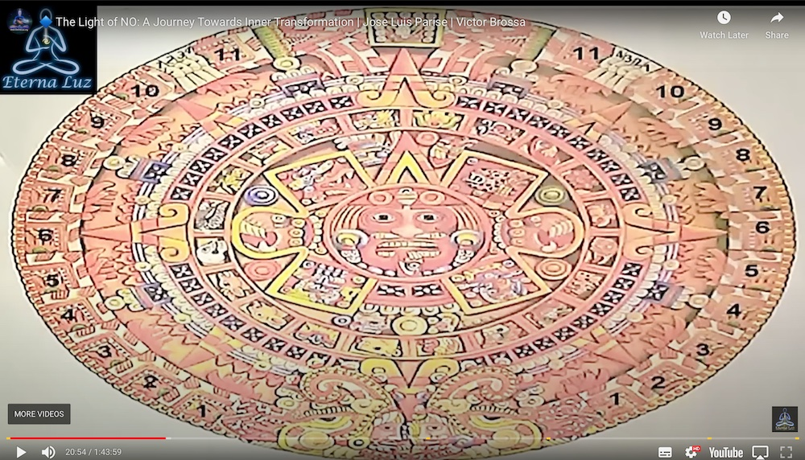

- https://www.youtube.com/watch?v=Dqvzlp-Ixbo
- Entrevista: José Luis Parise - Victor Brossah
- José Luis Parise: Director escuela edipo.org
- arteritual.com
- Luz / Oscuridad
- Sí / No
- Placer / Búsqueda de crecimiento
- Nuestra propia carcel
- Láminas de esquemas de culturas originarias
- Cuestiones de lo iniciático
- Si llega por los canales de los medios masivos de comunicación, cumple función de arqueotipo que se decide como paradigma y a tí no te da lugar, no da lugar de 1-1
	- Uno no puede ser el objeto de un paradigma que lo lleve a su iniciación
	- Cuando se convierte en un paradigma cultural, ya no sirve.
- La idea de encontrar la luz, y que la oscuridad es un problema demuestra que no tenés la más mínima idea de como es el camino.
- Gurú: Significa oscuridad y luz.
- 
- 4 estados luminosos de la mente
	- En cultura moderna lo anclan al hemisferio interno; no es así.
- Contingente: Lo que uno cree que no puede manejar
- Posible -> Necesario = Eje de luz / Eje de lo que sí / Eje de lo denso
- Imposible -> Contingente = Eje de lo que no
- No se puede iluminar algo con el polo positivo de la batería nomás
- El mago nos conecta con un mundo más allá de lo humano, más allá del ego, más allá del no.
- La magia es un puente que une lo humano con lo divino.
- Magia: General realidad propia, sin incidir en la vida de los demás.
	- La dignidad genera realidad propia.
- Hay gente que tiene tendencia a lo luminoso, y gente que tiene tendencia a lo nebuloso.
- No se pueden unir energías de luz y de sombras al gusto del "YO".
	-
- 
	- 11 pasos de la magia
	- La lengua en el centro de tu universo.
	- Con las orejas (depredadores) salir a cazar lo que quiere
	- Alrededor 4 fichas que detienen la luz del sol
		- La periferia es tu realidad; la luz necesita pasar por la sombra de los 4 glifos
- No hay fuerzas buenas y malas; solo fuerzas que nos gustan y fuerzas que no.
- 4 glifos son los 4 paradigmas
	- Religión: Mal / Bien
	- Economía: Tienes / No Tienes
	- Ciencia: Posible / Imposible
	- Política: Puedes / No puedes
- De los 4 paradigmas viene todo lo que nos van a decir
	- Lo que sí y lo que no.
- Hay una parte del esquema que la humanidad intenta sacar; la parte más oscura.
- Bhagavad Gita
	- El diálogo más importante de la historia de la humanidad
	- El primer diálogo de
	-