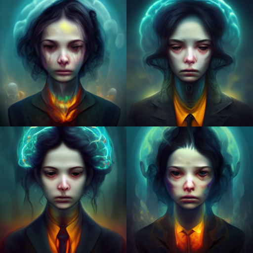

- It's a sort of AI service for computer generated imagination pictures based on human prompted terms.
- All these images were generated by computer AI guided by human.
- https://www.midjourney.com/showcase/
- They are the team to generating digital images what LogSeq is the team to creating a thinking environment
- Attempts at directing the AI:
	- Human with raised arms energetic body overlapping physical body in a held space
		- 
		- Super creepy, not what I had in mind
	- Circle of people sitting around in a solarpunk village setting
		- 
		- Ok I see how that instruction might be misinterpreted
	- People sitting in a circle in nature
		- 
		- Alright, that's a little closer to what I had in mind. Give me variations of V1
		  
		- Pretty cool stuff
	- [[Digital Garden]]
		- 
	- Emotional body expanding from heart of humanoid shape in psychedelic space, Alex Grey style
		- 
		- Pretty good, interesting that the style direction worked quite well. The images still feel a little creepy
	- Bright fantasy world inside head of person in sorrowful environment
		- 
		- I accidentally asked for variations on V4
			- 
			- It looks very dark, I wanted more emphasis on the fantasy world
		-
-