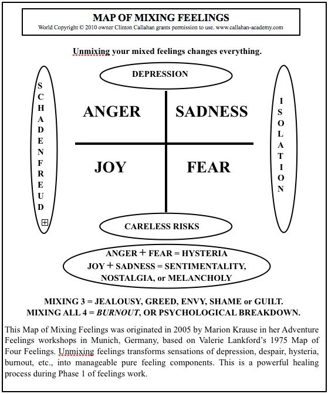

- 
- Much disempowerment occurs through unconsciously mixing root emotions together. Mixing emotions is not good or bad, is just something we can do for either [[Unconscious Purpose]] or [[Conscious Purpose]].
- It is possible to learn to [[Unmix Emotions]] as a practical skill.
- ## Examples
	- Anger + Sadness
		- Depression
		- Resignation
	- Sadness + Fear
		- Isolation
		- Despair
		- Hopelessness
		- powerlesness
		- Loneliness
	- Anger + Fear
		- Hysteria (>Fear)
		- Aggression (>Anger)
	- Sadness + Joy
		- Nostalgia (>Joy)
		- Sentimentality ()
		- / Melancholy
	- Joy + Fear = Excitement / Careless risk taking
	- Anger + Joy = Schadenfreude (feeling glad when someone elses loses or feels pain)
	- Mixing 3 emotions together:
		- Superiority, jealousy, greed, envy, guilt, shame, vengeance, and lack of self-esteem
- ---
- Reference: https://unmixemotions.mystrikingly.com/
## Let's start at the beginning...
### 4 Feelings and 4 Emotions

We strongly encourage you to read thoroughly the [4 Feelings Bubble](http://4feelings.mystrikingly.com) and the [4 Emotions Bubble](http://4emotions.mystrikingly.com) before diving into the unmixed emotions Bubble.

Feelings, emotions and mixed emotions are [distinctions](http://distinctionary.mystrikingly.com) far outside of the modern culture [gameworld](http://gameworldbuilder.mystrikingly.com).

[Building matrix](http://buildmatrix.strikingly.com) in your [5 bodies](http://5bodies.mystrikingly.com) might be necessary before actually starting the work of separating mixed emotions.

However, it is not because you are not aware of a distinction that this distinction is not acting in your life.

It is possible that most people actually carry mixed emotions in their bodies.

There is nothing wrong or bad about this. And, much disempowerment occurs through unconsciously mixing root emotions together.

For example, when you mix anger and sadness together you will have an experience known as depression. Depression is simply the name that has been given to what it feels like to blend anger with sadness. You can have the experience of depression any time you want simply by mixing anger and sadness together. You can also end the experience of depression any time you want simply by separating the anger and sadness from each other and experiencing and expressing each of them in their pure form.

The same is true for the other emotions mixes, as shown in the Map of Mixed Emotions below.
	- Mixing **sadness** and **fear** creates isolation or despair.
	- Mixing **anger** and **fear** creates hysteria.
	- Mixing **sadness** and **joy** creates nostalgia, sentimentality or melancholy.
	- Mixing **joy** and **fear** creates the excitement of careless risk taking.
	- Mixing **anger** and **joy** creates schadenfreude: feeling glad when someone else loses or feels pain.
	- Mixing **three emotions together** creates sensations that are particularly gripping, such as superiority, jealousy, greed, envy, guilt, shame, vengeance, and lack of self-esteem. Because three emotions are involved and the sensations are so strong, it can seem as if the situation is unsolvable. Yet three-emotion mixes can also be directly unmixed.  
	  Mixing four emotions together is what causes burnout – emotional paralysis and psychological breakdown – a very confusing, disempowering and disturbing experience.
## Possibility Coaches Needed

These states can be easily and suddenly transformed when the emotions are separated and experienced in their pure form.

I have seen this demonstrated in remarkable fashion innumerable times when persons suffering from near catatonia by mixing together three or four emotions went through the short guided process of respectfully separating their emotions one from the other. These people suddenly regained levels of functionality and relationship they had not experienced in years, if ever.

This is a revolutionary discovery, as yet unknown in modern society. Even healing practitioners, for the most part, do not yet teach the simple inner navigation skills of separating the emotions. And they could. Here is the thoughtmap.

Although largely unknown in mainstream culture, having clarity about mixed emotions is a cornerstone of next culture. If you are a psychotherapist, mediator, trainer, consultant, healer or nurse and you demand that your clients separate their emotions while they communicate, you may be shocked by how effectively this procedure brings a person back into their own natural health and sanity.

Here is a scary question: how many people take brain drugs or are locked away in institutions simply because they submit themselves to the belief system of a society that does not yet have clarity about mixed emotions?

Bringing clarity about emotions into mainstream society starts with teaching teachers. If you care about children then you have a job on your bench: find ways to require teachers in modern-society schools to gain adult level feeling skills and communications training as elements of their qualification before being certified to work as a teacher.

Will you do it?
- ## Unmixing Procedure
  
  The four primary emotions – mad, sad, glad, and scared – are useful for healing when experienced in their pure form. Mixing emotions is not bad or wrong; it simply creates certain disempowering results, such as superiority, lack of self-esteem, confusion, or depression.
  
  Modern culture does not want its citizens empowered to think and feel independently or it would provide an entirely different educational system. Next culture requires clear emotions from you. Your first steps into next culture may well be through unmixing your emotions.
## Demonstration & Distinction Unmixing Emotions

Anne-Chloé Destremau while holding space for a client to unmix her emotions delivers a number of powerful distinctions about how to truly unmix your emotions in your heart and not in your head.

[Possibility Coaching #23 - Anne-Chloé Destremau 22 February 2021](https://www.youtube.com/watch?v=ExQ7rShcRs8)
## Experiments
### MIX YOUR EMOTIONS ON PURPOSE

Make 30 minutes or an hour of experiment time for yourself undisturbed and during this, pick two emotions such as anger and fear, and consciously mix them together having the experience of what it's like to mix anger and fear. Sometimes mix more anger and sometimes mix more fear, so you can have more experiences. If you find new experiences of mixing the anger and the fear please send them to the StartOver Team. Try to mix all the combinations of emotions. Write it down, and do it for one combination. Copy paste and have a experiment for each combination of emotions. You can add in the research - what are the stories, the voices, when you are having that particular mixed experience. What is triggered? the stories and experience can also be the trigger for that mixed emotion. Then you also get your triggers.

#MatrixCodes/UNMIXEMO/01

Related Article: [Depression is a Mixed Feelings](https://possibilitymanagement.org/studyingit/article/depression-is-a-mixed-feeling/)

Illustration: 

Illustration: 
### DEVELOP CLARITY FOR SENSING MIXED EMOTIONS

Go to the Brene Brown website and read through her list of human emotions. There is a card on the website. Put a link. For each one, list them. For each one, copy this list to your beep book, and for each one find out which combination of each pure emotion, write down percentages that add up to a hundred. Keep in mind that even though disgust is given as an example of a fifth feeling Inside Out the combination that makes disgust is physical body nausea plus anger plus fear.

NOTE: useful to do in possibility team. If you an the team also go into the experience.

#MatrixCodes/UNMIXEMO/02
### MAKE STORIES THAT TRIGGER MIXED EMOTIONS

Come up with a story for each one of those emotions. If you say the story this emotion could easily come. My pet parakeet just ate my pet cat and can easily cause

Great to do in PTeam. Stage Work. Improv. Worktalk. Stage Work in a workshop. One story could be the Aliens are coming and they are eating all corporate managers! Woohoo! Hysteria. Nostalgia.

The way this works is one person, either you or someone in the group starts a story. After 2-3-4 sentences, it h as to be an emotional story. People start saying what mixed emotion comes up from that story and in a way keep this story going. One story can create different mixed emotions in different people. It is not guaranteed to cause the same mixed emotion for everyone. Once you get the mixed emotion for everybody you go to the next story and you shout out the mixed emotion and you shout to make it more intense. If you feel this, who are you persecuting, who are you running from ,who are you rescuing... this reveals our inner reaction patterns to mixed emotions.

It can be very funny also.

#MatrixCodes/UNMIXEMO/03
### DISCOVER THE TRUE INFORMATION BEHIND SHAME

Shame is a mixed emotion of anger sadness and fear. The shame is such a big mixed emotion that we get knocked unconscious by it so quickly and have all sorts of automatic reaction responses when we feel shame. It's like really we are unconscious. Each person figure something that they are ashamed about, in a team, it's better in a team. And then under that, write down exactly the anger which is part of the shame, the fear part of the shame, the sadness part of the shame and precisely.

This is not about the feelings that you feel about the shame, but the feelings that you mix to create the shame.

When you get what you're angry about exactly

What are you feeling angry about what you're feeling ashamed of?

I am ashamed that I did not get the right answer. Why are you angry about it? Why are you scared sad about it?

Use the anger, sadness and the fear to do the emotional healing process. Make use of the treasure that you just discovered. Make a boundary.

#MatrixCodes/UNMIXEMO/04
### EMBARASSEMENT

Same as above.

#MatrixCodes/UNMIXEMO/05
### JEALOUSY

Same as above.

#MatrixCodes/UNMIXEMO/06
### GUILT

Same as above.

#MatrixCodes/UNMIXEMO/07
### LEARNING HOW YOU ARE USING MIXED EMOTIONS TO LIE

WATCH A TELEVISION SERIES EPISODE. Stop it at any moment. Put it on pause and each time one of the characters has a mixed emotion or a pure emotion. Stop it, write their name, write down the pure emotion or the mixed emotion and what it is about. The main drama that is used in the television series, the characters lie. Somebody says "are you okay?" "yes." "anything going on?" "I'm fine" "what did you tell them?" it's a lie. The stories are twisted. Write down the lies and write down the mixed emotion as the motivation to lie. Discuss how this may be occurring in some place in your life.

#MatrixCodes/UNMIXEMO/08
### BECOME A MIXED EMOTION PRIVATE INVESTIGATOR

Do this aloo9ne or with one another person. Go into town, in the shopping mall, or in a business, a cafe, restaurant. Scan and identify mixed emotions in the different people. Write down what the mixed emotion is and what it is about. Note: since most people have their numbness bar really high ,you will have to lower your numbness bar to sense the suppressed the mixed emotions behind the person's facade. The makeup, laughter, style, glasses, hair.

You're a private investigator and if you really want to, if somebody seems interesting or there seems to be an opening. Bring your Beep Book like Sherlock Holmes, somebody is interested, standing in line at the movie theater you can say hey I am a mixed emotion private investigator and I am learning and practicing scanning for you mixed emotions do you want me to tell you want I discovered? if they say no, whatever and if they say yes then you can go ahead and see if it's accurate. Invite them to your next PTeam or EHP Dojo.

#MatrixCodes/UNMIXEMO/09
### UNMIX THE MIXED EMOTIONS IN YOUR PHYSICAL BODY

This experiment is an emotional healing process and is best done with a spaceholder like a feelings practitioners. You have stored mixed emotions in your organs, bones, different tissues. And the symptoms are often that you have some kind of pain or discomfort. Hashimoto gut disease. Crohn's disease. The emotional healing process is to pull out and umix the mixed emotion from that organ and put them back in the resonant tissues where they belong, the pure feeling.

#MatrixCodes/UNMIXEMO/10x3
### GIVING VOICE TO YOUR MIXED EMOTIONS WHILE SHOPPING

Go to a grocery store or a vegetable market. Stand in the fruit and vegetable section. stand in front of the bananas, Notice the process of mixing emotions that you are going through to select a bunch or handful of bananas. For example,.. the clues are the voices, the opinions. For example:

this is too big. Too many bananas. It is the mixed emotion of fear and sadness... I might not eat them all and they go bad and I waste them and I might have to make banana bread again and I have nobody to eat it with, despair. So I could break the bunch in half, another mixed emotion, somebody will catch me, somebody might be watching, there might be a rule... The next thing might be, these are not ripe enough, sadness, despair, depression I have no power over the bananas to make them ripen faster, aggression towards the bananas. Excitement that they are the perfect bunch, overripe, and you have this victimization that this grocery store would try to sell overripe bananas right there in public. You see somebody buying bad banaas and you feel shadenfraude and you feel hahahaha... You might feel excitement when you see overripe bananas and you know you can come back and get the dumpster bananas and dry them in your solare dehydrator.

This huge amount of mixed emotions is happening just while buying bananas.

Then you move to the apple seciton.

Go to a shoe store and start over.

#MatrixCodes/UNMIXEMO/11
-