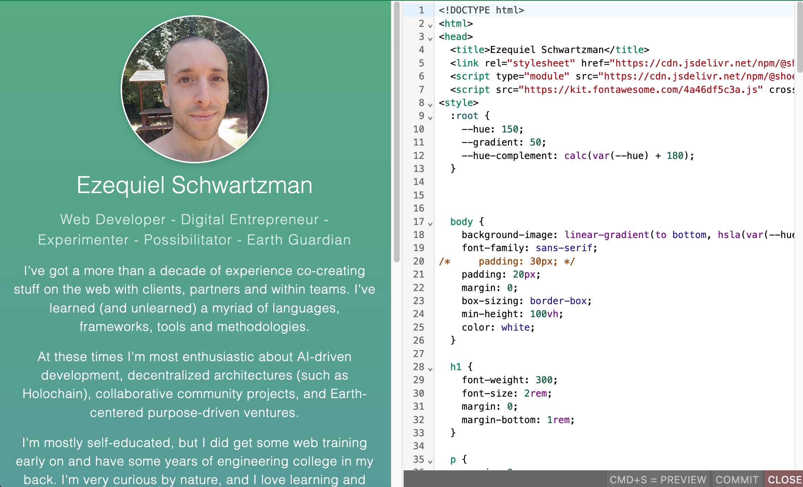

url:: https://archy.site/

- url:: https://github.com/zequez/archy-collab
-
- ## Description
- This project is about creating a collaborative web building environment where we all share the same tools, and the websites can be edited effortlessly. It's sort of like a community led Wix or Squarespace, but simpler to use.
- I created it with the goal of use it for my own projects because I was fed up with the frontend tooling and deployment workflows. My personal website is actually hosted on this platform. Whenever I want to edit my website now, I can just got to my website, activate the editor, edit the HTML, commit, and be done! No more opening VSCode, doing commits, pushing, and having a whole cloud-based deployment workflow such as Github pages or Vercel for a simple HTML site.
- Right now it only allows you to edit the websites as raw HTML, but visual editing tools, and AI-assisted web building are in the roadmap. Additionally, the backend used is Atomic Server, so it's very flexible and you can create whole complex web apps with it.
- ## Screenshots
- 
	-