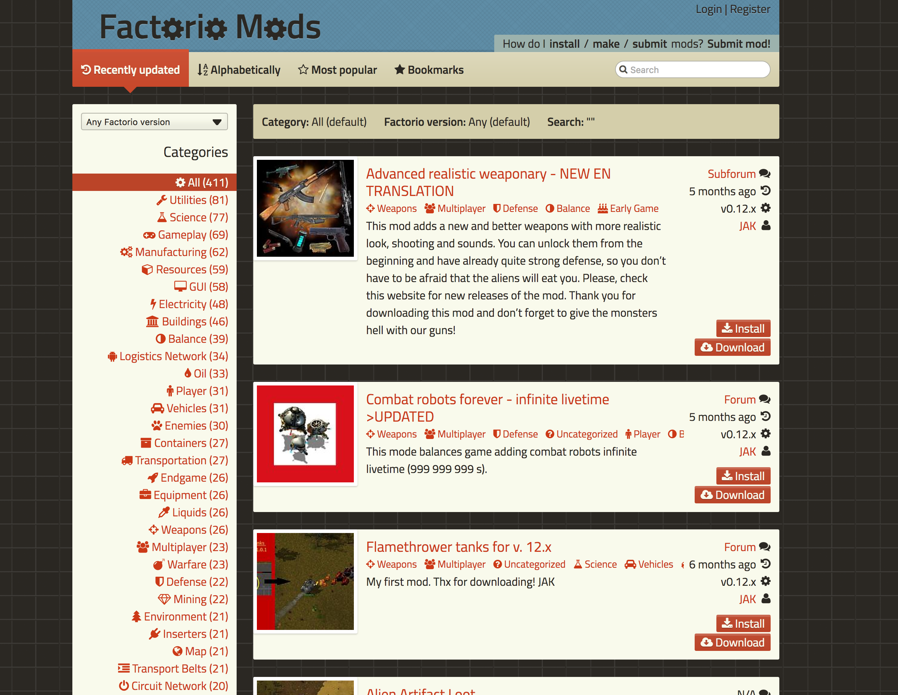

url:: https://github.com/Zequez/FactorioMods

- end-date:: 2015-07
- start-date:: 2014-06
- ## Description
	- FactorioMods was a fan-made web app made on Rails to host Factorio mods (Factorio is a videogame).
	- The backend was made on Rails and the front end wasn't anything fancy in the JS department, although the CSS was made from scratch (with SASS).
	- After I published the app I got contracted officially by the Factorio team to make an official API and web portal, although they wanted the backend to be done with a Python. In the new web app, which now lives in https://mods.factorio.com/ the front end is entirely made on React, to take advantage of the API backend.
	- Now the old web app just redirects to the official portal. But it's still hosted on a free Heroku dyno for viewing.
- ## Screenshots
	- 
	-