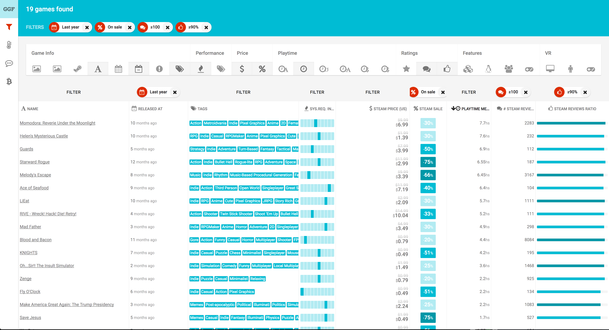

url:: https://github.com/Zequez?tab=repositories&q=ggfilter

- start-date:: 2016-01
- end-date:: 2019-01
- skills:: Ruby on Rails, Ruby, React, TypeScript, JavaScript, CSS, HTML, Redux, web scraping
- ## Description
	- GGFilter was a filterable database of games; scraped from Steam and from the Oculus Store.
	- It was in 3 parts, all equally important.
	- The scrapers are bundled in a pure ruby gem with different submodules for each type of scraping: games list, game pages and reviews from Steam, and video cards benchmarks (for the system requirements index).
	- The Rails server works mostly as an API and has the Rake tasks to run the different scrapers on cronjobs.
	- The client is made with React+Redux and it communicates with the server through the API.
	- The project is not under active development and after the free Heroku shut down, so did GGFilter; the scrapers hadn't been working for a while anyway
- ## Screenshots
	- 
-