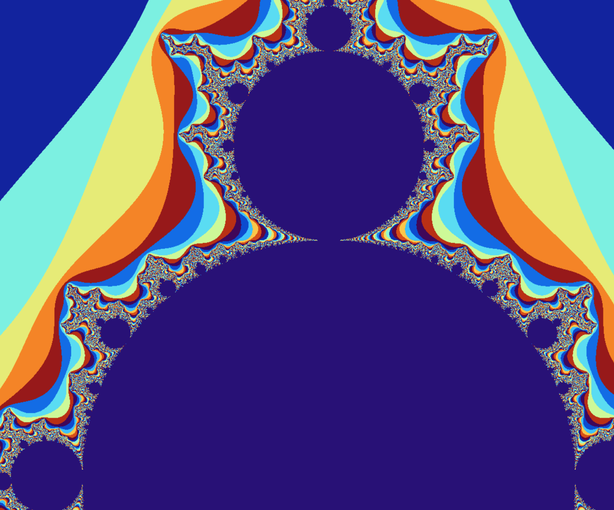
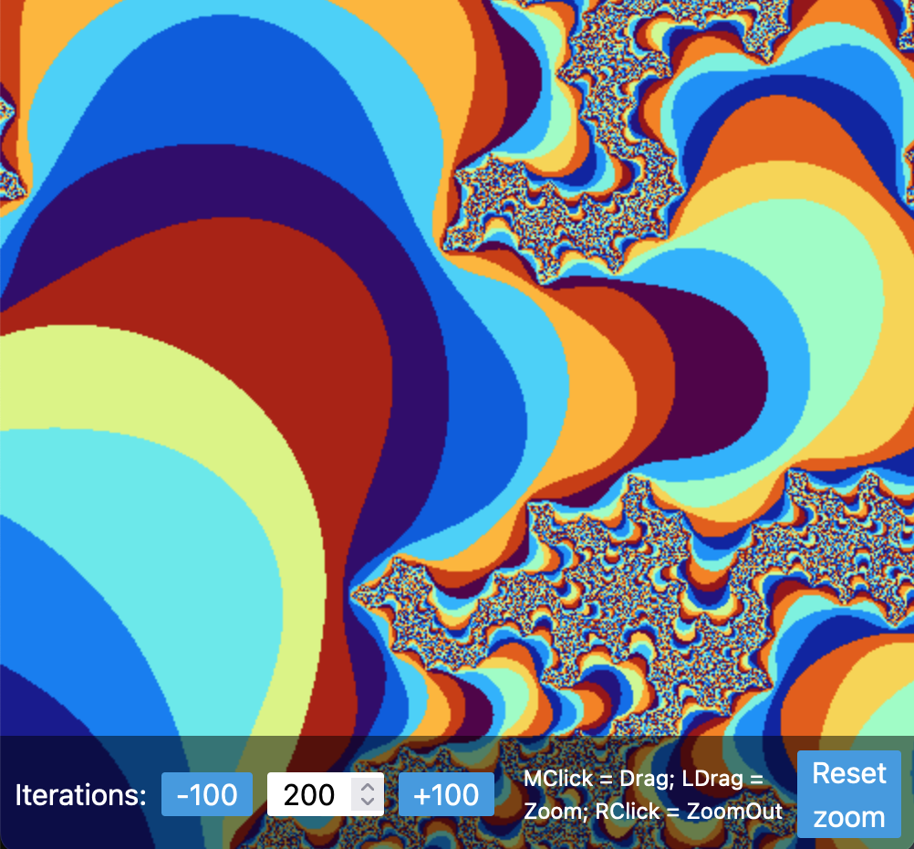
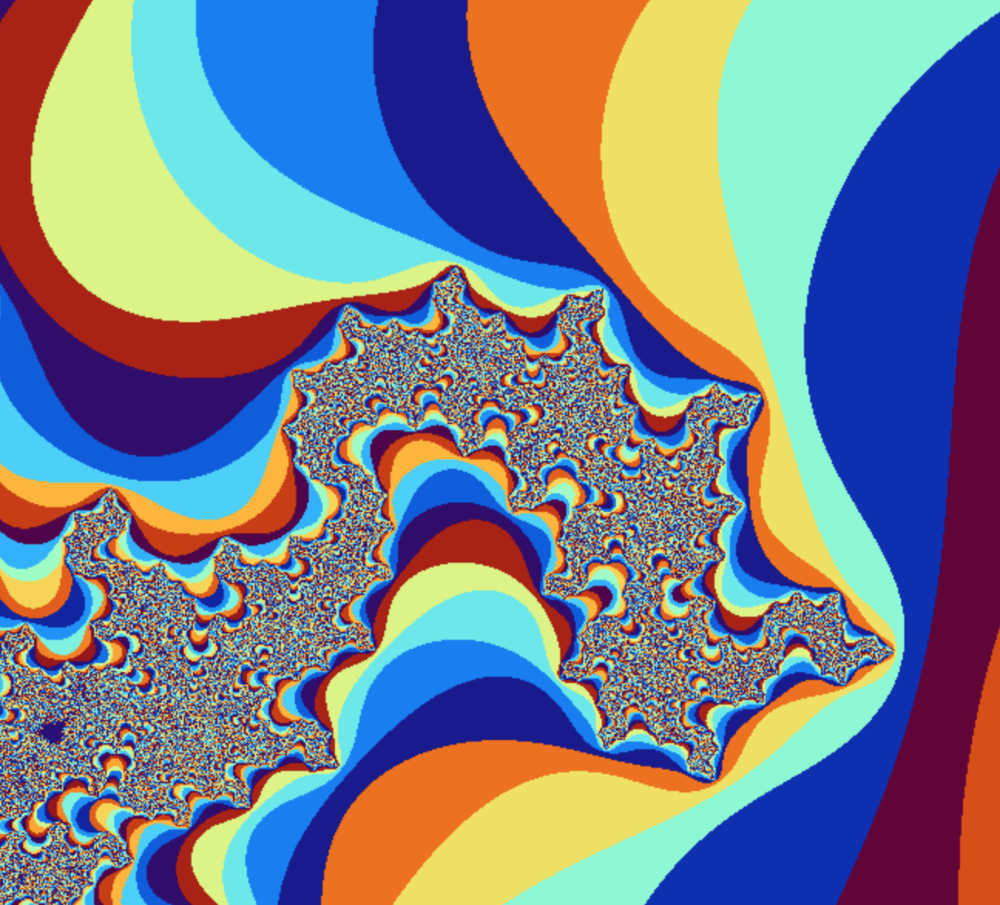
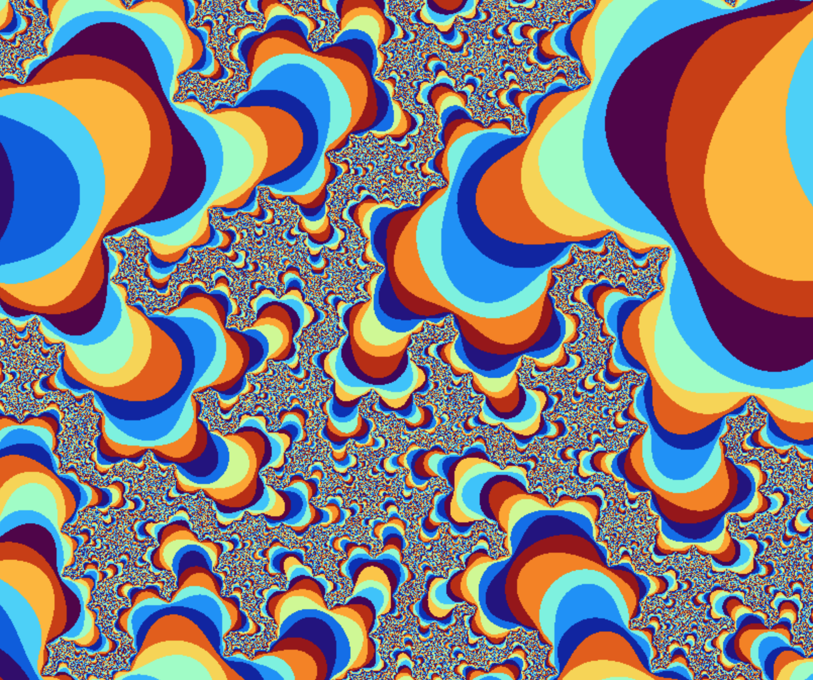

end-date:: 2020-10-01

- url:: https://github.com/Zequez/mandelbrot-sandbox
- url:: http://mandelbrot.zequez.space/
- ## Description
- On this project I experimented with building a Rust-based web assembly tool that calculated the Mandelbrot fractal. Then I used React to create an UI to explore it.
- The project can still be optimized and enhanced.
- ## Screenshots
- 
- 
- 
- {:height 769, :width 910}
-
	-