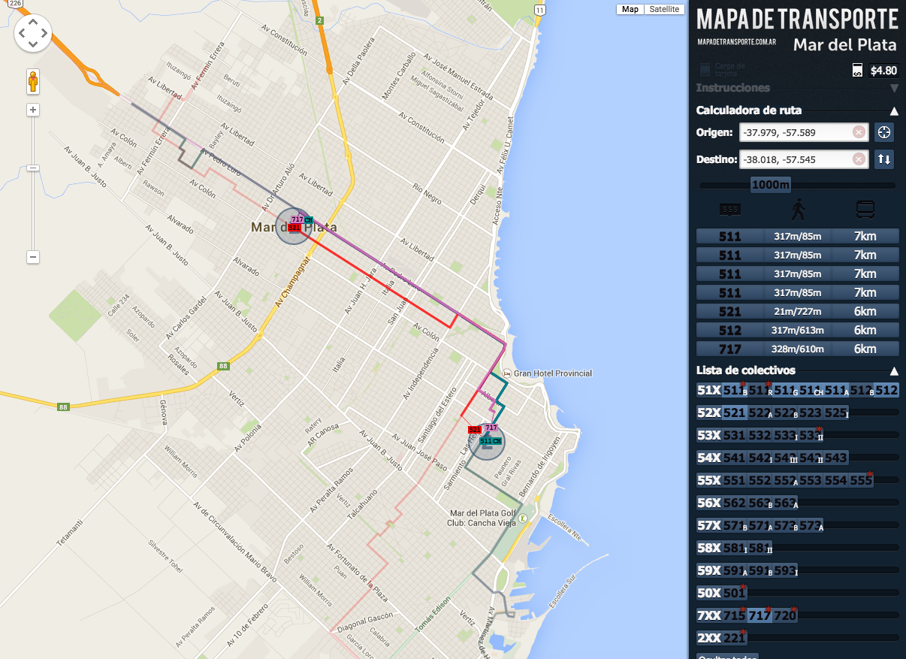
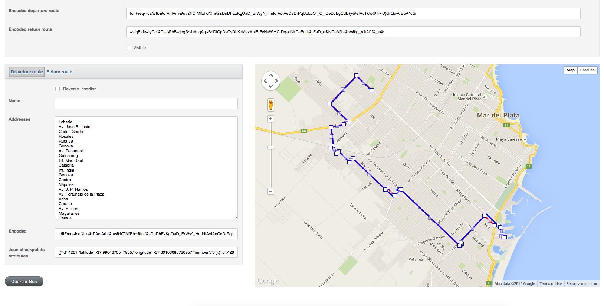

end-date:: 2012-07-01

- start-date:: 2012-04-23
- url:: https://github.com/Zequez/mapa-de-transporte
- skills:: Web Development, JavaScript, Ruby, HTML, SQL, Front-end Development, Ruby on Rails, CoffeeScript, CSS
- ## Description
	- Mapa de Transporte was my first serious Rails project, although it's mostly front-end intensive, done with pure vanilla JavaScript/CoffeeScript, without any framework.
	- The app lets you see all the routes at the same time, and instantly find the closest buses to connect 2 points in the city. I'm a data freak, that's why I tried made all the data easily accessible and visible at the same time. The app also let you set the distance you're willing to walk to filter buses. And it displays all the charging spots to recharge the bus card in the whole city.
	- The app also had a backend that lets you administer all the buses and buses routes.
	- The app has long been deprecated in favor of other apps and Google Maps which now supports my city local public transportation, and it's now online anymore. The source code it's still available on Github.
- ## Screenshots
- 
- 
-