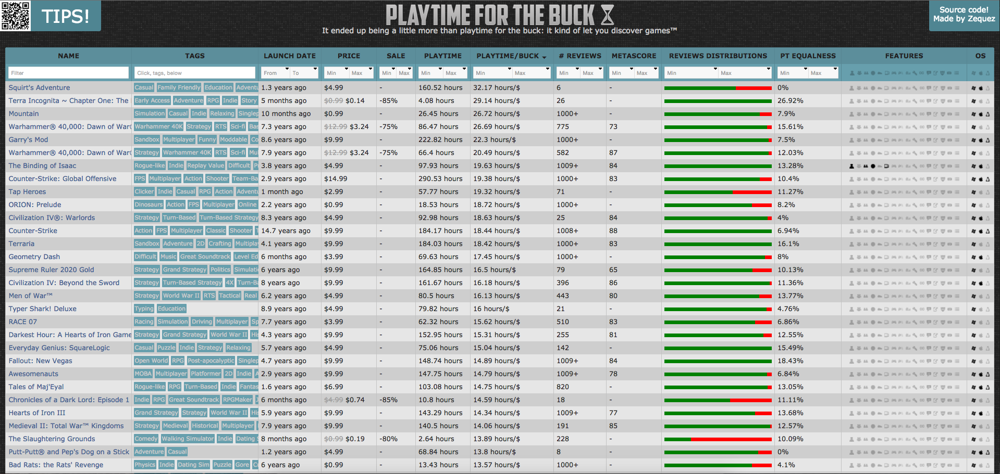

-
- ## Description
	- Initially when Steam started the reviews system, I saw that they included the playing time of the person for each review. So I though, *"wouldn't it be nice to see the average playing time for every game?"* and if you divide it by the price of the game, you can see... the *playtime for the buck*.
	- The idea was to scrap all the games and  all the reviews and make a database with them, then I could analyze the data and sort it however I wanted! I ended up adding much more than playtime/buck, you can filter and sort games in multiple ways.
	- Anyway, the front end was pure JavaScript, without frameworks, and it didn't have any backend, it was all an static page hosted on Github pages (it's open source) and it downloaded the data from a compressed .json database that was created and updated with a cronjob. The scrapers were made in Ruby.
	- As you can imagine, the project wouldn't scale well without a backend, so I set myself forward to start working on GGFilter, which was the successor of this app.
- ## Screenshots
	- 