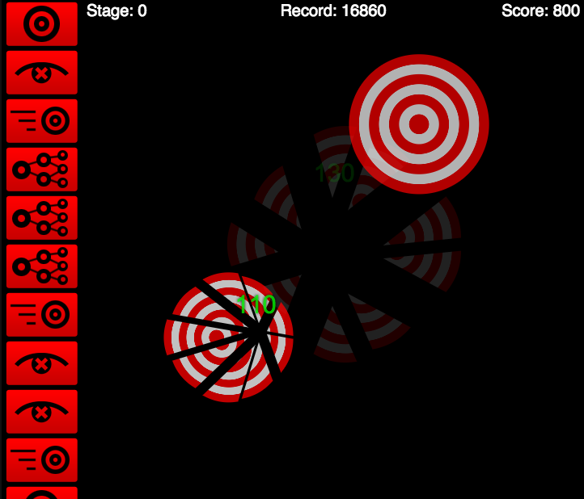

url:: http://oldsite.zequez.space/sandbox/blindmice/

- url:: https://github.com/Zequez/zequez.github.io/tree/master/sandbox/blindmice
- ## Description
	- Little game I made while learning JS canvas and having fun.
	- You basically find yourself in a canvas, and different targets appear, and you have to click them
	  to "shoot" them.
	- You have a limited time to clear the targets after they appear, if you miss the time window you lose, and if you misclick a target you lose points. The game also have different stages that are selected randomly.
	- Game stages:
		- **Normal stage:** Targets just appear one by one on the screen, you lose if you miss the time window.
		- **Blind stage:** Same as normal stage, but you can't see your mouse.
		- **Moving stage:** The targets cross the screen from the border, if you miss it you lose.
		- **Ramification-target stage:** First target it's alone, then 2 targets appear, then 3 targets, then 4 targets. You also lose if you miss the time window.
	-
	-
- ## Screenshots
	- 