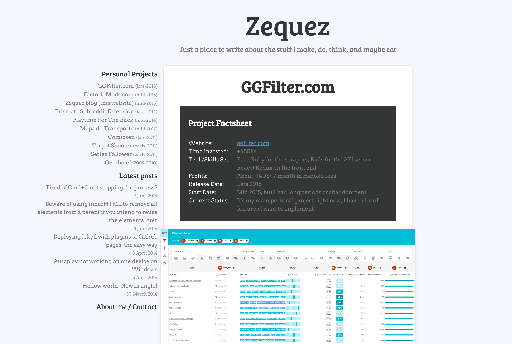

title:: Portfolio/Zequez.com

- url:: http://oldsite.zequez.space/
- url:: https://github.com/Zequez/zequez.github.io
- skills:: Middleman, HTML, JavaScript, CSS
- end-date:: 2017-03-01
-
- ## Description
- This used to be my first personal blog, and portfolio. Although I didn't really write too much, I just published all my projects, big or small.
- The blog itself was a static website made with Middleman, hosted on Github pages. It's a pretty simple design made by me.
- Still online for archiving purposes, but outdated.
- Also try ↑↑↓↓←→←→BA :P
- ## Screenshots
- 
	-