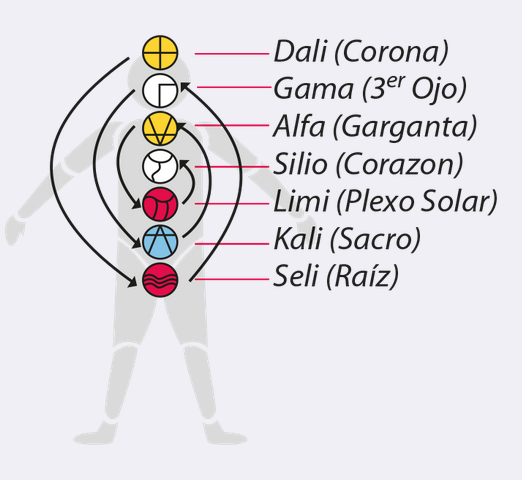

- 
	- >Así como el aire es la atmósfera del cuerpo, así el tiempo
	  es la atmósfera de la mente.
- ## Sitios
-
- ## Sellos Solares
  collapsed:: true
	- Dragón
	- Viento
	- Noche
	- Semilla
	- Serpiente
	- Enlazador de Mundos
	- Mano
	- Estrella
	- Luna
	- Perro
	- Mono
	- Humano
	- Caminante del Cielo
	- Mago
	- Águila [15/20]
	  id:: 62e6adae-c36a-4760-95db-01f7e33f6097
		- Crear Mente Visión
	- Guerrero
	- Tierra
	- Espejo
	- Tormenta
	- Sol
- ## Tonos Galácticos
  collapsed:: true
	- Magnético
	- Lunar
	- Eléctrico
	- Auto-existente
	- Entonado
	- Rítmico
	- Resonante
	- Galáctico
	- Solar
	- Planetario [10/13]
	  id:: 62e6ae04-10a3-4dba-8b52-4d8b01f0ce6d
		- Producir Perfeccionar Manifestación
	- Espectral
	- Cristal
	- Cósmico
- ## Plasmas Radiales
  id:: 62e367b6-ac5b-4623-b770-08a4098f8e7e
  collapsed:: true
	- > los siete Plasmas Radiales: los fluidos eléctricos que son los componentes básicos de la creación (¡incluso antes de los quarks!). Estos plasmas emergen desde el centro de la galaxia -  ellos también son absorbidos  y radiados a partir de los siete chakras. Estos plasmas son la base de una nueva tecnología telepática, por la que incluso podemos crear el puente arco iris alrededor de la Tierra.
	- 
	- {:width 250}
	- Plasmas
		- DALI
		  background-color:: #978626
			- Fuerza térmica (Atina)
			- "Mi padre es la conciencia intrínseca, yo siento el calor"
		- SELI
		  background-color:: #793e3e
			- Fuerza lumínica (Fluye)
			- "Mi madre es la esfera última, yo veo la luz"
		- GAMA
		  background-color:: #787f97
			- Fuerza lumínico-térmica (Pacifica)
			- "Mi linaje es la unión de la consciencia intrínseca y la esfera última, yo alcanzo el poder de la paz"
		- KALI
		  background-color:: #264c9b
		  id:: 62e367ef-7bb7-4a40-9356-6be73509c085
			- Poder: Agente catalítico (Establece)
			- Chakra: Sacro
			- Afirmación: "Mi nombre es el glorioso nacido del loto, yo catalizo la luz y calor interior"
		- ALFA
		  background-color:: #978626
			- Electrón doble extendido (Libera)
			- "Mi país es la esfera última no nacida yo libero el electrón doble extendido en el polo sur"
		- LIMI
		  background-color:: #793e3e
		  id:: 62e367f3-164b-451e-94ac-5c11d02aebdd
			- Electrón mental (Purifica)
			- "Yo consumo pensamientos dualistas como alimento, yo purifico el electrón mental en el polo norte."
		- SILIO
		  background-color:: #787f97
		  id:: 62e367f5-63d7-43f7-9889-fb9aa52fc90c
			- Electrón neutrón mental (Descarga)
			- "Mi función es llevar a cabo las acciones del Buda, yo descargo el electrón neutrón mental en el centro de la tierra."
			- Meditación global por la paz puente arcoiris!
- ## Meditación del puente arcoiris
	- 1.