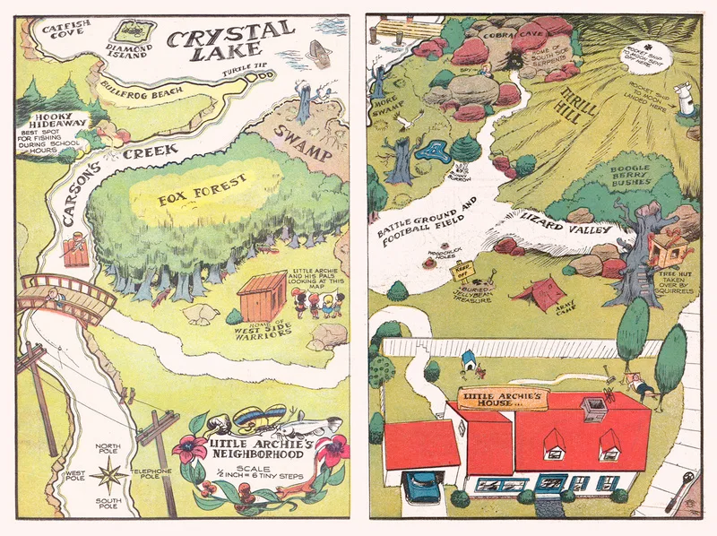
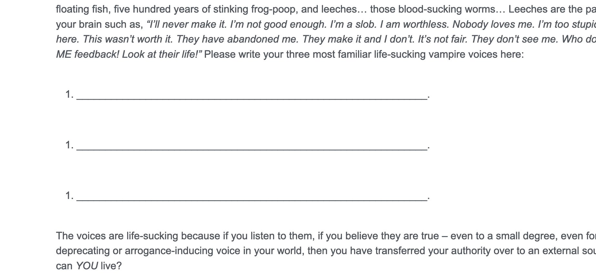

public:: true

- # Ideas to improve the current experience
	- Add a sort of forum thread to each page where you get one independent thread for each person.
		- Could be used to post proof of an experiment done.
		- Gems from the threads could be shared among wider circles or in social media.
	- Add a matrix-points widget on each page that allows you to record that page matrix points directly on the page by clicking.
	- Vertical browser tabs
		- Does anyone has a suggestion as for a personal discipline for keeping a low amount of tabs?
			- I have 326 tabs open related to Possibility Management; I think maybe the UI of the browser is not designed for this sort of exploration. So maybe a true exploratory interface can be designed that runs on the browser does away with the idea of managing this alien "tab" concept of sorting and categorizing. And just weaves it into a coherent exploration game.
			  collapsed:: true
				- Wild idea, could a sort of drawn map image be generated that weaves all the pages into a picture?
					- 
		- Sorted by recently used or most used tabs
		- Search functionality
	- Multiple languages?
		- Can it be made so the translating itself is a rewarding fun social experience?
		- Allow players to report the languages they understand
		- Make a dashboard for the translations progress
		- Make the translation flow easy so anyone can do it without needing to create a separate site.
		- Site authors can choose translation delegates that take responsibility for the translation of that page on a specific language.
	- Make author or authors of each page explicit, and show their personal website and contact information
	- Add social component by seeing the matrix points reported by other players with their proof; and allow other people to confirm these.
		- Make a public stream of reported matrix points.
		- Form accountability teams that will confirm your matrix points
	- Show the UI on other sites, such as YouTube too
		- We can even detect if the video reached the end and suggest reporting it
	- Extend links for books and films with free options.
	- Global view of all existing next-culture teams grouped by purposes and bioregions
	- Something like this:
		- 
		- Could actually be made so you can write it on site. Many experiments or exercises could work like this.
	-
	-